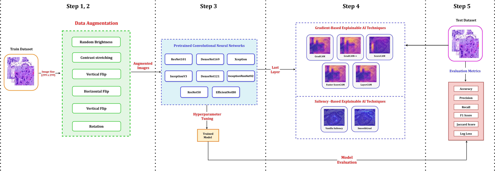
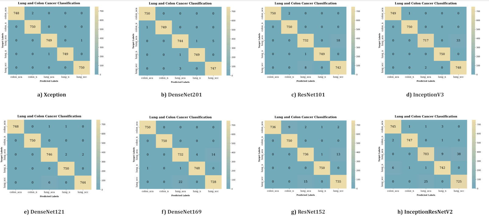

# Exploring Explainable AI Techniques for Improved Interpretability in Lung and Colon Cancer Classification
## Abstract
<!--Lung and colon cancer are serious worldwide health challenges that require early and precise identification to reduce mortality risks. However, diagnosis, which is mostly dependent on histopathologists' competence, presents difficulties and hazards when expertise is insufficient. While diagnostic methods like imaging and blood markers contribute to early detection, histopathology remains the gold standard, although time-consuming and vulnerable to inter-observer mistakes. Limited access to high-end technology further limits patients' ability to receive immediate medical care and diagnosis. Recent advances in deep learning have generated interest in its application to medical imaging analysis, specifically the use of histopathological images to diagnose lung and colon cancer. The goal of this investigation is to use and adapt existing pre-trained CNN-based models, such as Xception, DenseNet201, ResNet101, InceptionV3, DenseNet121, DenseNet169, ResNet152, and InceptionResNetV2, to enhance classification through better augmentation strategies. The results show tremendous progress, with all eight models reaching impressive accuracy ranging from 97% to 99%. Furthermore, attention visualization techniques such as GradCAM, GradCAM++, ScoreCAM, Faster Score-CAM, and LayerCAM, as well as Vanilla Saliency and SmoothGrad, are used to provide insights into the models' classification decisions, thereby improving interpretability and understanding of malignant and benign image classification -->


## Table of Contents
- [Proposed Methodology](#experimental-methodology)
- [Dataset Availability](#dataset-availability)
- [Results](#results)
- [Contact Information](#contact-information)
- [Citation](#citation)


## Proposed Methodology


    
## Dataset Availability

We utilized the **LC25000** dataset.
<!--, which comprises 25,000 color pictures of lung and colon tissues classified into five categories: colon cancer, benign colonic tissue, lung adenocarcinoma, lung squamous cell carcinoma, and benign lung tissue. Each class consists of 5,000 images cropped to 768 by 768 pixels. The collection is divided into colon and lung image sets in accordance with HIPAA compliance guidelines. It's instrumental in developing diagnostic tools for lung and colon cancers, driving progress in medical imaging research.-->

The dataset can be accessed from [here](https://www.kaggle.com/datasets/xilezhu/lc25000).


## Results
### Performance Metrics Comparison of Various Pre-trained CNN Models
| Model             | Accuracy | Precision | Recall | F1-Score | Jaccard Score | Log Loss |
|-------------------|----------|-----------|--------|----------|---------------|----------|
| Xception          | 0.9989   | 0.9989    | 0.9989 | 0.9989   | 0.9978        | 0.0384   |
| DenseNet201       | 0.9971   | 0.9971    | 0.9971 | 0.9971   | 0.9942        | 0.1057   |
| ResNet101         | 0.9928   | 0.9928    | 0.9928 | 0.9928   | 0.9858        | 0.2595   |
| InceptionV3       | 0.9904   | 0.9907    | 0.9904 | 0.9904   | 0.9812        | 0.3460   |
| DenseNet121       | 0.9896   | 0.9898    | 0.9896 | 0.9896   | 0.9795        | 0.3749   |
| DenseNet169       | 0.9888   | 0.9888    | 0.9888 | 0.9888   | 0.9781        | 0.4037   |
| ResNet152         | 0.9885   | 0.9886    | 0.9885 | 0.9885   | 0.9774        | 0.4133   |
| InceptionResNetV2 | 0.9765   | 0.9765    | 0.9765 | 0.9765   | 0.9547        | 0.8458   |

### Confusion matrix



## Contact Information

For any questions, collaboration opportunities, or further inquiries, please feel free to reach out:
- **Mukaffi Bin Moin**
  - Email: [mukaffi28@gmail.com](mailto:mukaffi28@gmail.com)

- **Fatema Tuj Johora Faria**
  - Email: [fatema.faria142@gmail.com](mailto:fatema.faria142@gmail.com)

- **Swarnajit Saha**
  - Email: [swarnajitsaha68@gmail.com](mailto:swarnajitsaha68@gmail.com)
- **Bushra Kamal Rafa**
  - Email: [brafa263.3@gmail.com](mailto:brafa263.3@gmail.com)
    
## Citation

<!-- If you find the dataset or the associated research work helpful, please consider citing our paper:

```bibtex
@misc{faria2023vashantor,
  title={Vashantor: A Large-scale Multilingual Benchmark Dataset for Automated Translation of Bangla Regional Dialects to Bangla Language},
  author={Fatema Tuj Johora Faria and Mukaffi Bin Moin and Ahmed Al Wase and Mehidi Ahmmed and Md. Rabius Sani and Tashreef Muhammad},
  year={2023},
  eprint={2311.11142},
  archivePrefix={arXiv},
  primaryClass={cs.CL}
} -->


